# KOOK Ticket · Go + WebUI

[](https://github.com/VanceHud/VanceKOOKTicketGO/actions/workflows/ci.yml)
[](LICENSE)
[](go.mod)
[](web/frontend/package.json)
[](Dockerfile)

KOOK 工单（Ticket）机器人，带自托管 WebUI 与 SQLite 数据库，**单二进制 / 单容器部署**。

参考并重写了 [musnows/Kook-Ticket-Bot](https://github.com/musnows/Kook-Ticket-Bot)（Python + 配置散落在多个 JSON 文件）的能力，
把配置、工单状态与聊天记录全部收敛到 SQLite，并补齐了 WebUI、实时推送、审计日志与一套可验证的安全基线。

**不需要写代码就能用**：申请一个 KOOK 机器人 → `./deploy.sh up` → 在 WebUI 里点几下即可上线。
无需公网 IP、无需数据库运维、无需 Node 环境 —— `./deploy.sh` 也不在你的机器上安装任何东西，全部跑在 Docker 里。

## 界面预览

<table>
<tr>
<td width="50%" align="center"><b>仪表盘</b><br><a href="docs/screenshots/dashboard.png">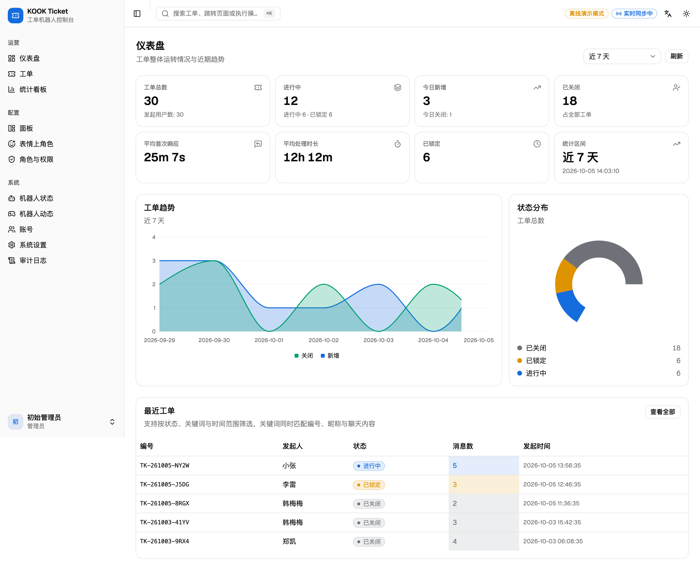</a></td>
<td width="50%" align="center"><b>工单详情（富消息时间线）</b><br><a href="docs/screenshots/ticket-detail.png">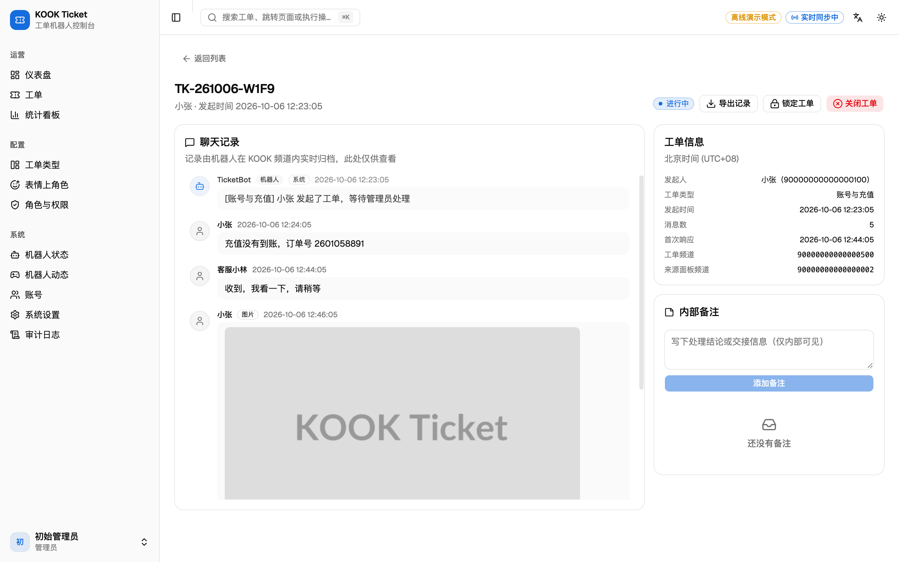</a></td>
</tr>
<tr>
<td width="50%" align="center"><b>统计看板</b><br><a href="docs/screenshots/stats.png">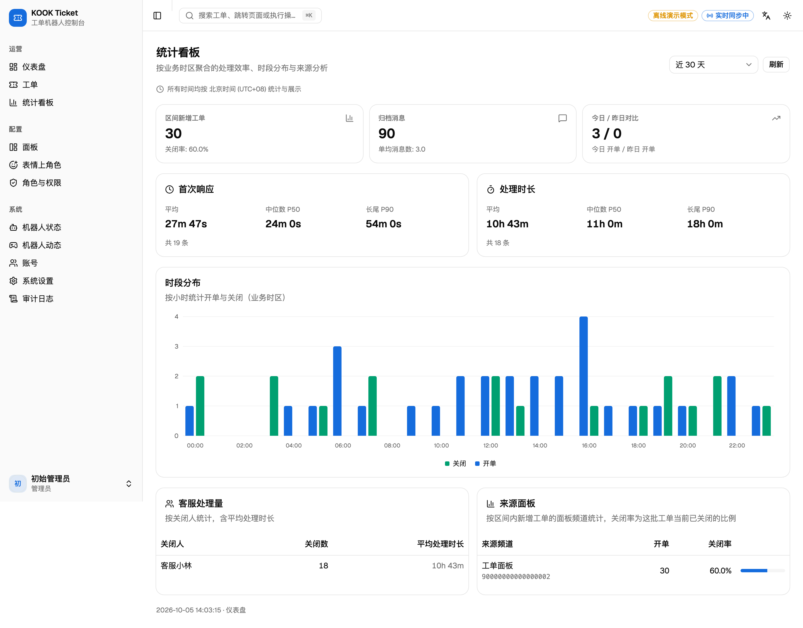</a></td>
<td width="50%" align="center"><b>工单列表</b><br><a href="docs/screenshots/tickets.png">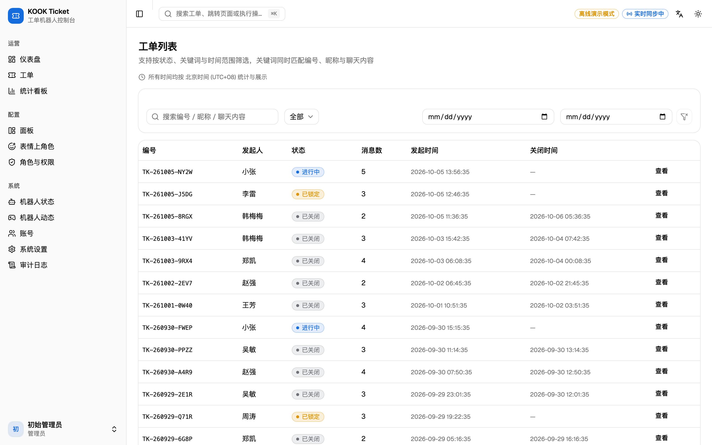</a></td>
</tr>
</table>

<details>
<summary>更多界面截图（工单类型 / 表情上角色 / 机器人状态 / 机器人动态 / 系统设置 / 审计日志 / 账号管理 / 登录页）</summary>

<table>
<tr>
<td width="50%" align="center"><b>工单类型</b><br>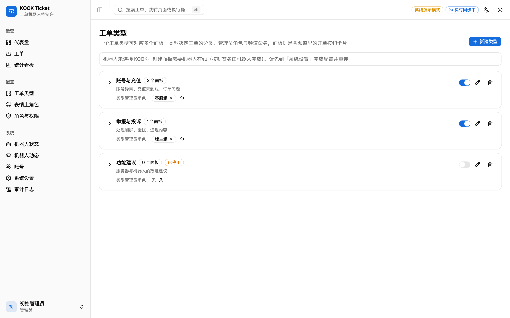</td>
<td width="50%" align="center"><b>表情上角色</b><br>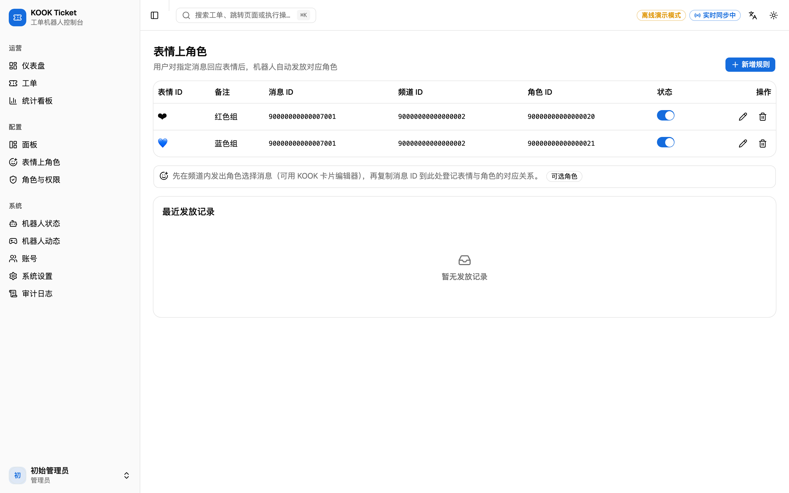</td>
</tr>
<tr>
<td width="50%" align="center"><b>机器人状态</b><br>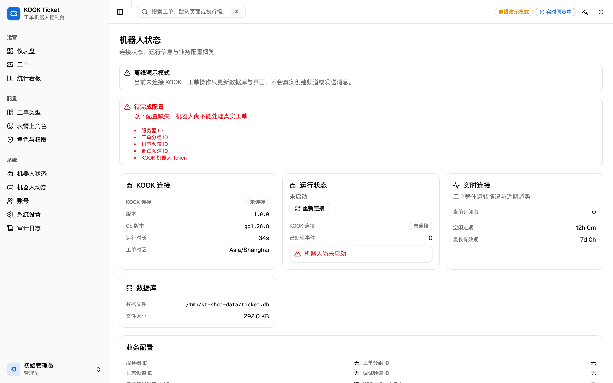</td>
<td width="50%" align="center"><b>机器人动态</b><br>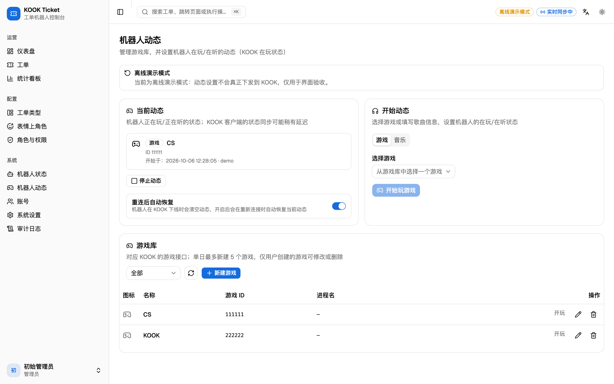</td>
</tr>
<tr>
<td width="50%" align="center"><b>系统设置</b><br>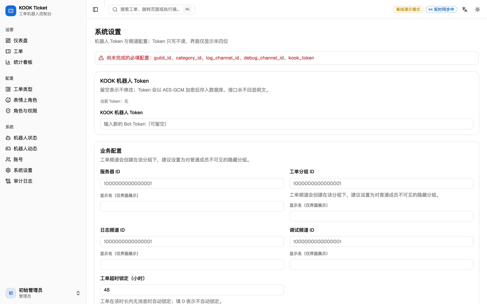</td>
<td width="50%" align="center"><b>审计日志</b><br>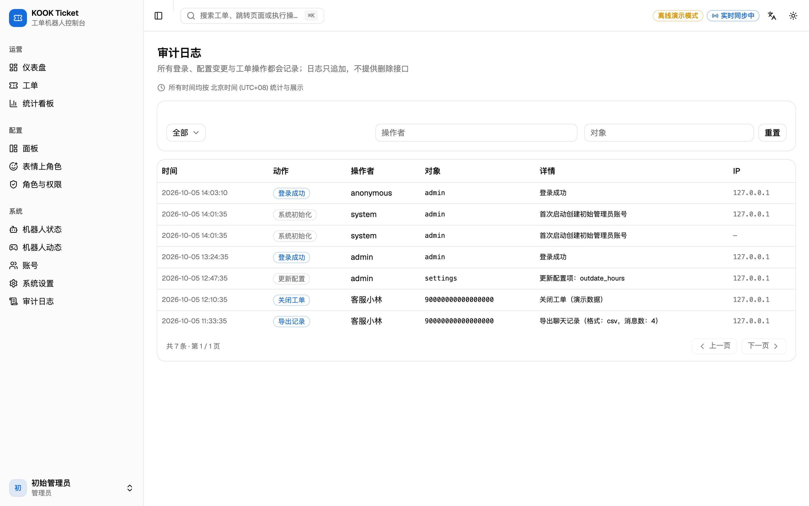</td>
</tr>
<tr>
<td width="50%" align="center"><b>账号管理</b><br>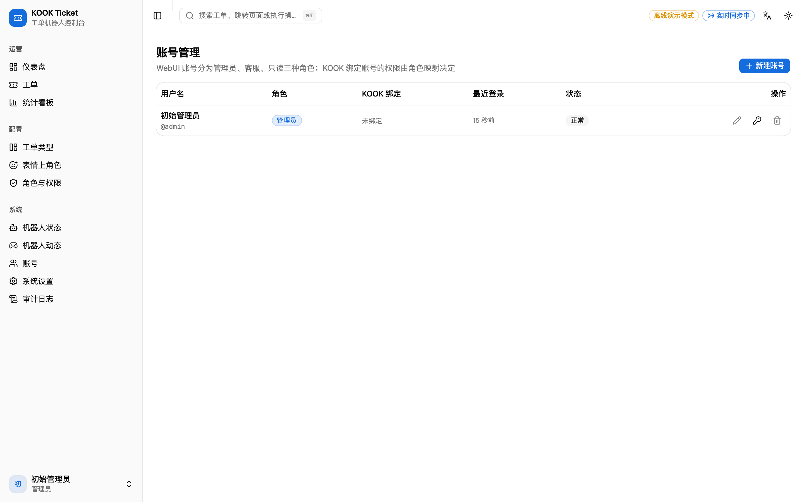</td>
<td width="50%" align="center"><b>登录页</b><br>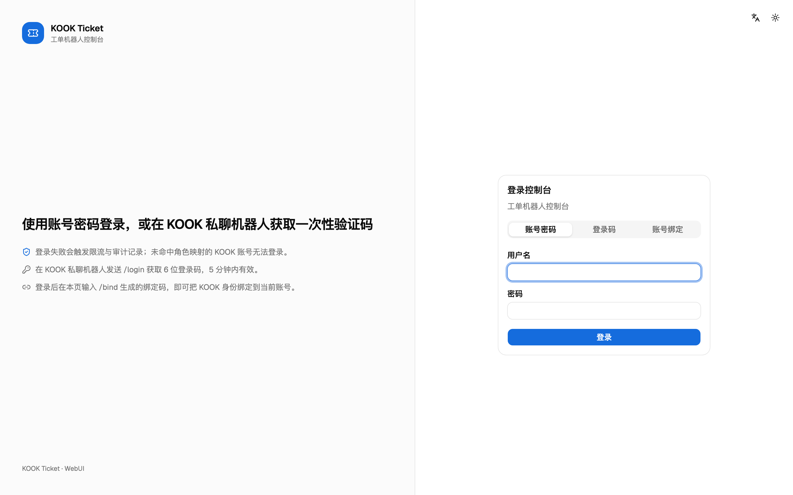</td>
</tr>
</table>

> 以上均为 `KOOK_DRYRUN=1` 离线演示模式下的真实截图（30 条演示工单），可直接复现：
> `KOOK_DRYRUN=1 ADMIN_PASSWORD='DemoTicket@2026' go run ./cmd/server`

</details>

> **当前进度：里程碑 1–6 已完成**：骨架与安全基线、WebUI 全部页面、Docker 交付、离线演示模式、
> 自研 KOOK 客户端（REST + WebSocket 网关）、真实工单流程（按钮开单 → 建频道 → 权限下发 → 关闭通知 → 删除频道）、
> `/login` 一次性登录码与 `/bind` 账号绑定、表情上角色与 WebUI 在玩动态管理，
> 以及**工单类型 / 面板与表情规则的 WebUI 增删改**和**统计看板**（分位时长、时段分布、客服处理量、来源与工单类型分析）。
> 所有时间默认按**北京时间（Asia/Shanghai）**展示与统计。
> 此外还对开单/关单链路做了性能优化（按桶限速 + 流程并发 + 事件与网关解耦，见第 8 节）：
> 本地集成测试里同一个开单流程从 4.0 秒降到 0.1 秒（真实环境取决于到 KOOK 的网络往返与平台额度）。剩余路线图见文末。

---

## 1. 功能一览

### KOOK 接入与工单流程

| 模块 | 说明 |
|---|---|
| KOOK 客户端 | 自研 REST 封装：**按平台限流桶**（`X-Rate-Limit-Bucket`）排队 + 自适应全局令牌桶（默认 8 req/s，连续成功缓慢提速、被 429 后临时降速）+ 429 退避重试；HTTP 连接池按并发调整 |
| WebSocket 网关 | zlib 解压、30s 心跳（6s 未收到 PONG 判定断线）、session resume 续传（`session_id` + `sn` 落库，进程重启/升级后仍续传同一会话）、sn 序号、指数退避重连（2s、4s、8s…上限 60s）；续传被拒（HELLO 错误码或握手阶段的 `reconnect(s=5, code=40107)`）时自动清空失效会话改用全新连接 |
| 按钮开单 | 校验面板与其工单类型（类型停用则拒绝）→ 一人一单 → 分配编号 → 在隐藏分组建频道（频道名 `类型｜短编号｜昵称`，建完即置为进行中）→ **并发**下发权限（全局管理员角色 + 工单类型管理员角色 + 开单人）、发送含「关闭/锁定」按钮的卡片（**含工单类型**）、发送面板自定义开单提示（支持 `{type}` 变量）→ 回到面板频道发送**仅开单人可见**的完成提示（含工单频道跳转链接，`temp_target_id`）。**开单时不发私信探测消息**（避免用户收到「私信通道测试」） |
| 关闭工单 | 管理员鉴权 → **并发**发送日志频道卡片与私聊开单人（开单人未开启私聊时在日志频道提醒管理员人工转达）→ 删除工单频道 → 落库并记录日志卡片消息 ID |
| 锁定 / 重新激活 | 通过频道权限位（2048 查看 / 4096 发言）实现“可看不可发”，并发送带「重新激活」按钮的提示卡片 |
| 超时自动锁定 | 每 10 分钟扫描超过 `outdateHours` 无活动的工单并锁定，同样发送提示卡片 |
| 消息归档 | 工单频道内的文本/图片/视频/文件/语音/卡片消息全部入库（机器人消息不污染记录）；图片/视频/语音/文件会存下资源地址与文件名，**卡片消息因平台事件不带内容，会自动调用 `message/view` 拉取原始 JSON 并生成文本摘要** |
| 命令 | `/ticket` `/tkcm` `/aar` `/tkhelp` `/hello` `/kill` `/login` `/bind` |
| 一次性码 | `/login` 签发 6 位登录码（Crockford Base32，5 分钟、一次性、按用户限频）；`/bind` 签发绑定码，在 WebUI「我的账号」中输入即可关联身份 |
| 表情上角色 | 对配置的消息回应表情即发放对应角色，换表情先撤销旧角色；失败会提示用户检查机器人角色位置 |
| 在玩动态（WebUI） | 机器人动态页：游戏库列表 / 新建 / 改名换图标 / 删除（对应 KOOK game 系列接口，受平台单日新建 5 个限制），以及设置「在玩/在听」动态（游戏或音乐，支持网易云 / QQ 音乐 / 酷狗）；动态持久化到数据库，机器人重连后可按开关自动恢复 |
| 运维 | `/kill @机器人` 触发优雅退出（容器自动重启）；WebUI 可一键「重新连接」重载配置（会先断开旧连接再续传同一会话，不产生并存会话） |
| 工单类型与面板（WebUI） | **一个工单类型可对应多个面板**：单页类型树展示「类型 → 面板」，类型负责分类名称、备注、启停与管理员角色（`/aar` 同步生效），面板是各频道里的开单按钮卡片。同一频道可新建任意多张卡片（各自独立文案、按钮文字与「开单后发送内容」），支持 KMarkdown 多行文案与实时预览；卡片文案或按钮文字变化时才重建卡片，仅修改「开单后发送内容」或调整面板所属类型时保存即生效、不会重建；可重建卡片（自动删除旧卡片）、启停、删除、跨类型改属。开单成功后机器人在工单频道内另发一条 KMarkdown 消息（留空则不发送），支持 `{user}`、`{user_name}`、`{ticket_no}`、`{time}`、`{type}` / `{type_name}` 变量，并会记入 WebUI 工单时间线。文案在发送前会归一化为 **KOOK 真正支持的写法**：首行 `# 标题` 改用卡片 header 模块（KOOK 的 KMarkdown 没有 `#` 标题语法），`__下划线__` 转成 `(ins)下划线(ins)`，`- 列表` 转成「• 项目」，因此 WebUI 预览与 KOOK 客户端显示一致 |
| 表情规则（WebUI） | 「消息 ID + 表情 → 角色」规则的增删改与启停，无需改动配置文件 |
| 统计看板 | 区间工单量与关闭率、首次响应与处理时长的**平均 / P50 / P90**、24 小时时段分布、客服处理量排行、来源面板分布、**工单类型分布**、今日 vs 昨日对比、归档消息量与单均消息数 |

### 数据与 WebUI

| 模块 | 说明 |
|---|---|
| 工单数据模型 | 工单（含工单类型快照）/ 聊天记录 / 备注 / 工单类型 / 面板 / 表情规则 / 审计日志全部入库，重启不丢状态 |
| 工单编号 | `TK-YYMMDD-XXXX`，Crockford Base32 随机段（去掉 I/L/O/U），按 `TICKET_TZ` 计算日期段，唯一索引 + 冲突自动加宽 |
| 工单状态机 | 进行中 / 已锁定 / 已关闭 / 创建中 / 创建失败，非法流转返回 409 并说明原因 |
| WebUI | 仪表盘（KPI + 趋势图 + 状态分布）、工单列表（**按状态 / 类型 / 关键词 / 时间筛选** + 分页）、工单详情（时间线支持文本/图片/视频/语音/文件/卡片富消息渲染 + 备注 + 操作 + 导出）、工单类型（类型树 + 面板管理）、表情上角色、账号管理、角色与权限映射、机器人状态（含重新连接）、机器人动态（游戏库 + 在玩/在听状态）、系统设置、审计日志、我的账号 |
| 配置管理 | KOOK Token（AES-GCM 加密存储、只写不回显）、服务器 / 分组 / 日志 / 调试频道、超时锁定小时数；保存后自动重连 |
| 账号与权限 | 管理员 / 客服 / 只读三种角色；KOOK 角色 → WebUI 权限映射表；未命中映射的用户无法登录 |
| 实时推送 | SSE 推送工单事件，列表与详情自动刷新，顶栏显示连接状态 |
| 导出 | 聊天记录导出 JSON / CSV（含 BOM，带媒体链接列）/ HTML（内容全部转义，图片内联、音视频/文件可播放下载） |
| 审计日志 | 登录、改密、配置变更、账号管理、工单操作、导出、机器人重连，全部只追加 |
| 离线演示 | `KOOK_DRYRUN=1` 写入演示工单，无需 KOOK Token 即可完整验收界面 |
| 检索 | 关键词同时匹配工单编号前缀、用户昵称、用户 ID 与聊天内容；通配符已转义 |
| 时区 | 业务时区默认 `Asia/Shanghai`：工单编号日期段、统计分日/分时都在北京时间下计算；前端所有时间也按该时区渲染（而不是浏览器本地时区），并在列表/审计/详情页标注「北京时间 (UTC+8)」 |

### 计划中

| 里程碑 | 内容 |
|---|---|
| 7 | TOTP 二步验证（数据库字段与登录态已预留） |
| 8 | 客服指派/抢单、开单表单模板 |
| 9 | 报表定时导出（CSV 邮件/Webhook 推送）、按客服的自定义工作量统计 |
| 10 | 多服务器（多 guild）支持、账号解绑接口 |

> 🚀 **一键部署**（推荐）：
>
> ```bash
> git clone https://github.com/VanceHud/VanceKOOKTicketGO.git kook-ticket && cd kook-ticket
> ./deploy.sh up            # 自动生成 .env、构建镜像、启动、健康检查、打印初始密码
> ```
>
> `./deploy.sh` 还提供 `upgrade`（备份 + 重建 + 健康检查）、`backup` / `restore`、
> `reset-password`、`status` / `logs`、`doctor`（环境自检）与交互菜单（直接运行 `./deploy.sh`）。
> 手工部署、反向代理与排错请看下方教程。
>
> 📘 **部署教程：[docs/DEPLOYMENT.md](docs/DEPLOYMENT.md)**：
> 从 KOOK 应用申请、权限与事件订阅，到 Docker Compose / 二进制 + systemd 部署、
> 反向代理与 HTTPS、首次配置顺序、备份恢复、忘记密码救援与排错速查表。

---

## 2. 快速开始

### 方式一：Docker（推荐）

```bash
git clone https://github.com/VanceHud/VanceKOOKTicketGO.git kook-ticket && cd kook-ticket

cp .env.example .env
# 生成加密密钥（用于加密存储 KOOK Token）
echo "APP_SECRET=$(openssl rand -hex 32)" >> .env

docker compose up -d --build
docker compose logs -f kook-ticket
```

启动后访问 `http://127.0.0.1:9235`。

初始管理员账号：
* 未设置 `ADMIN_PASSWORD` 时，会生成随机密码并打印在日志中（搜索 `initial_password`），**首次登录强制改密**；
* 设置了 `ADMIN_PASSWORD` 时使用该密码（需满足强度要求，否则启动失败）。

```bash
docker compose logs kook-ticket | grep initial_password
```

### 方式二：单二进制

```bash
make build                 # 构建前端 + 编译 bin/kook-ticket
APP_SECRET=$(openssl rand -hex 32) ./bin/kook-ticket
```

`make build` 会把前端产物同步到 `web/dist` 并被 `//go:embed` 打进二进制，因此最终只需分发一个文件。

### 方式三：离线演示模式（不需要 KOOK）

```bash
KOOK_DRYRUN=1 ADMIN_PASSWORD='DemoTicket@2026' go run ./cmd/server
```

会写入 30 条演示工单（含聊天记录、备注、3 个工单类型与对应面板、角色映射、表情规则与审计记录），
所有界面与操作都能跑通，但不产生任何 KOOK 侧副作用。

### 开发模式

```bash
make dev-backend     # 后端跑在 :9235（DryRun）
make dev-frontend    # Vite 开发服务器 :5173，自动代理 /api 到后端
```

---

## 3. 配置项

全部通过环境变量提供（`.env.example` 有完整说明）。

| 变量 | 默认值 | 说明 |
|---|---|---|
| `PORT` | `9235` | WebUI 端口（宿主机映射与容器内一致） |
| `DATA_DIR` | `./data` | 数据目录（SQLite 与自动生成的密钥） |
| `DB_PATH` | `$DATA_DIR/ticket.db` | 数据库文件路径 |
| `TICKET_TZ` | `Asia/Shanghai` | 工单编号日期段与「今日」统计口径 |
| `LOG_LEVEL` | `info` | `debug` / `info` / `warn` / `error` |
| `KOOK_DRYRUN` | `0` | `1` = 离线演示模式 |
| `KOOK_TOKEN` | 空 | 机器人 Token；也可稍后在 WebUI 填写（两者都加密入库） |
| `KOOK_GUILD_ID` | 空 | 服务器 ID |
| `KOOK_API_BASE` | 官方地址 | 覆盖 KOOK API 地址（自建代理/本地模拟平台） |
| `APP_SECRET` | 自动生成 | 原始输入至少 32 字节，建议随机生成；留空时写入 `$DATA_DIR/app_secret`（0600） |
| `COOKIE_SECURE` | `auto` | 会话 Cookie 的 Secure 策略：`auto` / `always` / `never` |
| `TRUSTED_PROXIES` | 空 | 可信反代地址（支持 CIDR），决定是否采信 `X-Forwarded-For` |
| `ADMIN_USERNAME` | `admin` | 初始管理员用户名 |
| `ADMIN_PASSWORD` | 空 | 初始管理员密码（留空则随机生成并强制首登改密） |
| `SESSION_IDLE_HOURS` | `12` | 会话空闲过期 |
| `SESSION_MAX_DAYS` | `7` | 会话绝对有效期 |
| `LOGIN_MAX_FAILS` | `5` | 窗口内登录失败上限，达到即锁定 |
| `LOGIN_WINDOW_MINUTES` | `15` | 失败计数窗口 |
| `LOGIN_LOCK_MINUTES` | `15` | 基础锁定时长（持续失败会指数延长） |

---

## 4. 安全设计

测试包含 HTTP 层集成测试，以及用**进程内模拟 KOOK 平台**（REST + WebSocket，含 zlib 压缩与网关握手）
跑通的工单链路测试。2026-10-05 的安全与效率审查已修复认证竞态、角色校验、导出注入与资源边界问题，
具体发现、性能验证和部署影响见 [审查报告](docs/SECURITY_REVIEW_2026-10-05.md)。本地测试不代表已验证真实 KOOK 或生产部署。

| # | 设计 | 验证方式 |
|---|---|---|
| 1 | bcrypt(cost=12) 哈希密码；强度校验（≥12 位、≥2 类字符、拒绝常见弱口令、拒绝纯重复） | `internal/auth` 单元测试 |
| 2 | 首次生成的随机密码强制改密，未改密前其它接口一律 403 | `TestForcedPasswordChangeBlocksOtherEndpoints` |
| 3 | 会话 token 256 位随机，数据库只存 SHA-256；空闲 + 绝对双过期；并发会话上限 5 | `internal/store` / `internal/auth` 测试 |
| 4 | 改密 / 改角色 / 禁用账号会立刻吊销该账号全部会话 | `TestForcedPasswordChangeBlocksOtherEndpoints` |
| 5 | CSRF 令牌由 `HMAC(APP_SECRET, 会话token)` 派生：不落库、会话内稳定（多标签页不互踢）、恒定时间比较 | `TestWritesRequireCSRFToken`、`TestCSRFTokenIsStableWithinSession` |
| 6 | 登录失败按 IP + 账号双维度限流，达阈值锁定并指数退避，全部写审计 | `TestLoginIsRateLimitedAfterRepeatedFailures` |
| 7 | 账号枚举防护：账号不存在与密码错误返回完全一致的响应，且都对占位哈希做一次 bcrypt 比对以抹平耗时 | `TestLoginFailureIsUniformAndAudited` |
| 8 | 服务端强制 RBAC：只读账号不能执行任何工单写操作，也不能访问管理接口 | `TestReadonlyRoleCannotOperateTickets`、`TestStaffCannotManageAccounts` |
| 9 | 管理员保护：不能修改/禁用/删除自己，且系统必须保留至少一个可用管理员 | `TestAdminCannotLockSelfOut`、`TestCannotRemoveLastActiveAdmin` |
| 10 | 安全响应头：`nosniff`、`X-Frame-Options: DENY`、`Referrer-Policy`、`Permissions-Policy`、CSP（`script-src 'self'`，无 inline script）、HTTPS 下 HSTS | `TestHealthzIsPublicAndSetsSecurityHeaders` |
| 11 | XSS 防护：KMarkdown 先转义再渲染；卡片/附件链接仅接受 HTTP(S)；HTML 导出转义聊天内容，CSV 中的潜在公式强制作为文本 | `TestExportMediaRejectsActiveSchemes`、`TestExportsDoNotTruncateAndEscapeSpreadsheetFormulas`、前端 `npm test` |
| 12 | panic 统一 recover：堆栈只进服务端日志，响应仅返回错误码 + 请求 ID | `TestPanicIsRecoveredWithoutLeakingDetails` |
| 13 | 反代可信：未配置 `TRUSTED_PROXIES` 时忽略 `X-Forwarded-For`，限流与审计拿不到伪造 IP | `internal/auth` 中间件实现 |
| 14 | KOOK Token 以 AES-GCM 加密入库，接口只返回掩码（`****a1b2`），审计不含内容 | `TestKookTokenIsWriteOnly` |
| 15 | SQL 注入与 LIKE 通配符注入防护（转义 `%` `_` `\`），关键词搜索已覆盖测试 | `TestSearchEscapesLikeWildcards` |
| 16 | 容器非 root（uid 10001）运行，支持 `read_only` 根文件系统 + `no-new-privileges` | `docker-compose.yml` |
| 16b | **按钮回调不可信**：value 只携带「动作 + 工单编号」，且经 `HMAC(APP_SECRET, 动作\|编号\|频道)` 签名；频道与用户一律以服务端字段和数据库记录为准 | `TestForgedButtonValueIsRejected` |
| 16c | 单服务器白名单：非配置服务器的频道事件直接丢弃 | `TestMessagesFromOtherGuildAreIgnored` |
| 16d | 一次性登录码只存哈希、一次性使用（`used_at IS NULL` 条件更新防并发重放）、按 IP 限流、失败原因统一提示 | `TestLoginCodeRejectsInvalidExpiredAndReused`、`TestLoginCodeIsRateLimited` |
| 16e | KOOK 身份唯一绑定：同一 KOOK 账号不能绑定多个控制台账号，同一账号不能绑定多个 KOOK 身份 | `TestBindCodeLinksKookIdentity` |
| 16f | 用户内容中的 KMarkdown 提及语法会被转义，避免通过备注/消息伪造 @全体成员 | `internal/kook` 卡片构造 |
| 17 | 数据文件权限：目录 0700、数据库与密钥 0600 | `internal/store` 测试 + 容器验证 |
| 18 | 依赖供应链：锁定依赖版本、`npm ci` 可复现；使用 `govulncheck` 与 `npm audit` 按当前漏洞库检查；运行镜像不含 Node/npm | 本次扫描结果见审查报告，容器结构见 `Dockerfile` |

注意事项：
* 暴露到公网请务必放在反向代理之后启用 HTTPS，并把代理地址写入 `TRUSTED_PROXIES`；
* 请设置 `APP_SECRET` 并妥善备份——更换该值后已存储的 KOOK Token 无法解密，需要重新填写。

---

## 5. 数据与备份

* SQLite（WAL 模式）保存在 `DATA_DIR`：`ticket.db`、`ticket.db-wal`、`ticket.db-shm`、`app_secret`。
* 所有时间戳以 UTC 存库（驱动的时间文本格式定宽，因此文本比较等价于时间比较），界面按浏览器本地时区渲染。
* 备份与恢复直接用脚本（备份内含数据库与密钥，恢复会校验密钥一致性）：

```bash
./deploy.sh backup                 # 在线备份（有 sqlite3）或停服冷备，自动保留最近 10 份
./deploy.sh restore                # 恢复最新备份（缺省），也可指定文件
./deploy.sh restore backups/kook-ticket-20260105-120000.tar.gz
```

* 备份内容为 `data/` + `deploy-env`（即 `.env`，内含 `APP_SECRET`）。
  **密钥必须与数据库一起保管**：只恢复数据库而没有密钥，数据库里加密的 KOOK Token 将无法解密。
* 恢复时脚本只替换数据目录**里面的文件**，不会替换目录本身
  （Docker 的 bind mount 在容器创建时绑定目录 inode，替换目录会导致容器继续写旧数据）。

---

## 6. 目录结构

```
.
├─ cmd/server/            # 程序入口：装配 config → store → ticket → api
├─ internal/
│  ├─ config/             # 环境变量装载与校验（密钥、时区、Cookie 策略）
│  ├─ secure/             # 随机数、SHA-256、AES-GCM、恒定时间比较
│  ├─ store/              # GORM 模型、迁移、仓储与统计查询
│  ├─ auth/               # 密码策略、会话、CSRF、限流、鉴权中间件
│  ├─ ticket/             # 工单状态机 + Platform 接口（KOOK 侧动作抽象）
│  ├─ ticketno/           # 工单编号生成与校验
│  ├─ keyedlock/          # 按 key 串行的互斥锁（同一用户/同一工单串行，不同对象并行）
│  ├─ kook/               # KOOK REST 客户端（按桶限速）、WebSocket 网关、卡片构造、测试用模拟平台
│  ├─ bot/                # 事件分发（分片保序）、开单/关闭/锁定流程、卡片文案、命令
│  ├─ api/                # gin 路由与 handler
│  ├─ eventbus/           # 进程内事件总线（SSE 数据源）
│  ├─ bootstrap/          # 首启初始化：管理员账号、环境变量入库
│  └─ dryrun/             # 演示数据
├─ web/
│  ├─ embed.go            # go:embed all:dist + SPA 兜底路由
│  ├─ dist/               # 前端构建产物（仅 .gitkeep 入库）
│  └─ frontend/           # React 19 + Vite + TS + Tailwind v4 + shadcn/ui
├─ docs/
│  ├─ DEPLOYMENT.md       # 从 KOOK 应用申请到反向代理的完整部署教程
│  ├─ SECURITY_REVIEW_2026-10-05.md  # 安全与效率审查记录（含修复与回归用例）
│  └─ screenshots/        # README 用的界面截图
├─ scripts/
│  ├─ e2e/                # Playwright 驱动的端到端 UI 验收（可选）
│  └─ screenshots.mjs     # 重新生成 docs/screenshots 的脚本
├─ .github/workflows/     # CI：gofmt / vet / test -race / oxlint / 前端构建
├─ Dockerfile             # 三阶段：Node 构建 → Go 编译 → alpine 运行
├─ docker-compose.yml     # 单容器部署（卷、健康检查、加固选项）
└─ Makefile               # dev / build / check / test / docker
```

---

## 7. 开发

```bash
make check      # gofmt 检查 + go vet + go build + 前端类型检查与构建
make test       # Go 测试（含 HTTP 层集成测试与模拟 KOOK 平台的端到端链路测试）
make docker     # 构建镜像
make dist       # 交叉编译发布包（linux/amd64、linux/arm64、darwin/arm64）
```

运维常用命令：

```bash
./deploy.sh doctor                           # 环境自检（Docker/端口/磁盘）
./deploy.sh status | logs | backup | restore # 状态、日志、备份、恢复
./deploy.sh reset-password admin             # 忘记密码（自动停服后重置再起服）

# 二进制部署时直接调用程序内置命令
./kook-ticket -version
./kook-ticket -reset-password admin
./kook-ticket -reset-password admin -password 'NewPass@2026x'
```

前端：

```bash
cd web/frontend
npm ci
npm run dev     # 开发服务器
npm run build   # 产物输出到 dist（再由 make build 同步到 web/dist 供 embed）
```

技术栈：React 19 · Vite · TypeScript · Tailwind v4 · shadcn/ui（官方 registry，Radix 基座）·
React Router · TanStack Query · TanStack Table · Recharts · react-hook-form + zod · react-i18next（中文 / English）。

后端：Go 1.26.8 或更新版本 · gin · GORM · `glebarez/sqlite`（纯 Go，无 CGO）· gorilla/websocket · `golang.org/x/crypto`。

---

## 8. 工单流程性能

开单/关闭要调用多个 KOOK 接口，[平台限流是按接口桶计的](https://developer.kookapp.cn/doc/rate-limit)，
因此「点一下按钮要等好几秒」通常不是网络慢，而是调用方式与限速策略的问题。当前实现：

| 做法 | 说明 |
|---|---|
| 按桶限速 | 读取响应头 `X-Rate-Limit-Bucket` / `Limit` / `Remaining` / `Reset`，**只对额度不足的那个桶排队**；某个桶额度用完不会拖慢其它接口。未拿到过额度的接口先串行探测，学到额度后再放开并发 |
| 全局速率自适应 | 默认 8 req/s、突发 4；连续成功 24 次后缓慢提速（上限为配置速率的 2 倍），被 429 后临时降速并退避重试。**不做永久降速**（旧实现会把全局速率改小且永不恢复，进程越跑越慢） |
| 流程并发 | 建频道后立即把工单置为「进行中」，随后「发卡片 + 权限下发 + 面板开单提示」并发执行（并发度由限流桶决定），不再用固定 `sleep` 硬拖延 |
| 事件与网关解耦 | 网关读取协程只收事件，处理交给按频道分片的工作协程（同频道保序、跨频道并行）。避免长流程把心跳 PONG 堵住 → 看门狗判定断线 → 重连续传 → 同一次按钮点击被重复处理 |
| 减少调用 | 关闭/锁定/重开复用带缓存的 `user/view` 结果，不再额外查询昵称；日志频道与私信通知并发发送 |
| 可观测 | 开单/关闭都会在日志里输出耗时与分阶段耗时（`elapsed` / `channel_ms` / `card_ms` / `grants_ms` / `notice_ms`），被限流时输出 `bucket` 与当前速率 |

> 快速判断线上是否卡在限流：日志里搜 `KOOK 接口被限流`，以及 `工单已创建` 这行的 `elapsed`。

改造前后对比（本地集成测试，同一个开单流程，模拟平台不设网络延迟）：

| 指标 | 改造前 | 改造后 |
|---|---|---|
| 开单总耗时 | 4.0s（权限下发阶段独占 4.0s） | 0.11s（`grants_ms` 0.10s） |
| 同一频道开单并发度 | 1（全局锁 + 每个主体间 `sleep 120ms`） | 3～4（并发下发，由限流桶决定） |
| 线上实际开单耗时（旧版本 DB 记录：占号 → 置为进行中） | 3.2s / 3.9s / 4.3s / 7.1s / 8.4s | —（真实环境受网络往返与平台额度影响） |
| `internal/bot` 全部集成测试耗时 | 约 92～97s | 约 8s |

---

## 9. 已知限制

* 工单类型与面板、表情规则的增删改通过 KOOK 命令（`/ticket`、`/aar`）或 WebUI 完成。
* `/ticket [类型名]` 会在类型不存在时自动创建；省略类型名时复用当前频道已有面板的类型，面板默认不发送开单提示，可在 WebUI「工单类型」页编辑。
* 升级旧库时会为每个存量面板自动创建一个同名工单类型并复制其角色，权限范围与升级前一致；随后可在「工单类型」页把面板合并到同一类型。
* 开单成功后，机器人会在面板频道补一条「仅开单人可见」的完成提示（KOOK `temp_target_id` 临时消息），其中 `(chn)` 频道提及可直接跳到工单频道。临时消息只对本人可见、会随客户端刷新消失，因此不作为唯一通知手段。
* WebUI 不提供"以机器人身份发言"，对话仍在 KOOK 内进行（按需求约定）。
* 单服务器（单 guild）设计；多服务器支持在路线图中。
* 未提供账号解绑接口：重新绑定需管理员直接修改数据库或后续版本补充。
* KOOK 平台接口若调整（权限位、事件结构），需要同步更新 `internal/kook` 与对应测试。

---

## 10. 许可与致谢

本项目以 [MIT 许可证](LICENSE) 开源，可自由用于商业项目、修改与再分发（保留版权声明即可）。

* **上游关系**：[musnows/Kook-Ticket-Bot](https://github.com/musnows/Kook-Ticket-Bot)（MPL-2.0）为本项目提供了**产品形态与流程设计**的参考
  （面板按钮开单、隐藏频道承载对话、关闭后删除频道、表情上角色等）。
  本仓库的代码为**独立实现**，未复制上游源码，也不包含其配置文件或素材，因此不受 MPL-2.0 约束。
  如果你认为某处存在疏漏，请开 issue 告知，会立即处理。
* 前端组件来自 [shadcn/ui](https://ui.shadcn.com/)（MIT）。
* 全部第三方依赖与内嵌文件的来源、许可证见 [`THIRD-PARTY-NOTICES.md`](THIRD-PARTY-NOTICES.md)。
* 字体、图标、脚本均随二进制自托管，**运行时不请求任何第三方 CDN**。

## 11. 参与贡献

欢迎提 issue 与 PR。动手前请先看 [`CONTRIBUTING.md`](CONTRIBUTING.md)（代码约定、提交前必过的检查、测试要求）。

* 报告安全漏洞请走 [`SECURITY.md`](SECURITY.md) 中的私密渠道，**不要开公开 issue**。
* 变更记录见 [`CHANGELOG.md`](CHANGELOG.md)。
